  

<h1>Hi, I'm A.VIKRAM👋</h1>
<h3>BTECH CSE STUDENT</h3>

 

 

## 🖥️ WHO AM I

  

 

## 🛠️ Tech Stack

  

 

## 💼 Experience

  

 

**ONLINE INTERNSHIP-EDIGLOGE
**OFFLINE INTERNSHIP -SELVI SOFTWARE TECHNOLOGIES
 

 

## 📊 GitHub Analytics

<!--
github-readme-stats.vercel.app (stats card + top-langs below) is
currently returning HTTP 503 "DEPLOYMENT_PAUSED" — its free-tier
Vercel deployment hit a usage cap. This is a known recurring issue
with that public instance and it typically comes back on its own.
Uncomment the two lines below once https://github-readme-stats.vercel.app
loads normally again.

-->

## 🐍 Contribution Snake

<picture>
  <source media="(prefers-color-scheme: dark)" srcset="https://raw.githubusercontent.com/Gowtham-R03/Gowtham-R03/output/github-contribution-grid-snake-dark.svg">
  <source media="(prefers-color-scheme: light)" srcset="https://raw.githubusercontent.com/Gowtham-R03/Gowtham-R03/output/github-contribution-grid-snake.svg">
  
</picture>

<!--
Optional add-ons — uncomment once you have the account/token:

WakaTime weekly breakdown:

Spotify now playing (via spotify-github-profile by kittinan):

Holopin badges:

-->

 

📫 **Reach me:** [vikram.csee@gmail.com](mailto:vikram.csee@gmail.com) · [LinkedIn]([https://linkedin.com/in/gowtham-r-kod](https://www.linkedin.com/in/a-vikram-7a272b276?utm_source=share_via&utm_content=profile&utm_medium=member_android))

 

