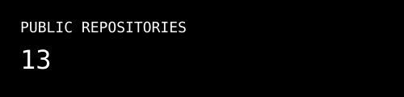
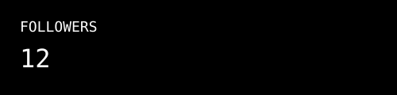
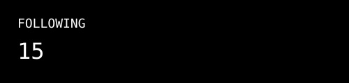
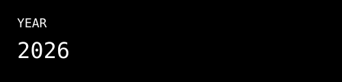

<div align="left">


<br><br>

</div>

<div align="right-top">

# A. VIKRAM

### `FULL STACK DEVELOPER • PYTHON • AI`

Building interactive applications and exploring AI-powered solutions.

<br>


[](https://github.com/vikram662005)
[](vkrm.portfolioo.vercel.app)
[](https://www.linkedin.com/in/a-vikram-7a272b276?utm_source=share_via&utm_content=profile&utm_medium=member_android)

</div>

---

## `01 / ABOUT ME`

> Computer Science Engineering Student  
> Full Stack Developer  
> Python Developer  
> AI Enthusiast  
> Building projects and learning new technologies

---

## `02 / TECH STACK`

### LANGUAGES


### FRONTEND


### BACKEND & DATABASE


### AI / MACHINE LEARNING


### TOOLS


---

## `03 / FEATURED PROJECTS`

### AI INTERVIEW COACH

AI-powered interview platform that generates interview questions, processes answers and provides feedback.

**Stack:**  
`Next.js` `React` `Tailwind CSS` `Prisma` `PostgreSQL` `Google Gemini API` `Clerk` `Inngest` `Vercel`

---

### DEEPFAKE AUDIO DETECTION

Machine-learning based system for detecting manipulated or synthetic audio.

**Stack:**  
`Python` `Librosa` `MFCC` `Chroma Features` `Mel-Spectrograms` `Scikit-learn` `NumPy` `Pandas`

---

### INDUSTRIAL VISIT PLANNING & BOOKING SYSTEM

Web application for planning and managing industrial visits.

**Stack:**  
`ASP.NET` `SQL Server` `HTML` `CSS` `JavaScript`

---

## `04 / GITHUB ACTIVITY`

<div align="center">





<br><br>





</div>

---

## `05 / CURRENTLY`

```text
[+] Building full-stack applications
[+] Learning AI integration
[+] Improving Python
[+] Exploring new technologies
[+] Working on personal projects

06 / CONNECT
<div align="center">

</div>
<div align="center">
KEEP BUILDING • KEEP LEARNING • KEEP EXPLORING
</div> ```
